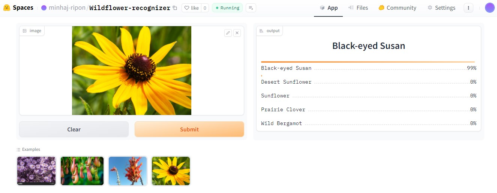

# Wildflower-Recognizer

An image classification model from data collection, cleaning, model training, deployment and API integration.  
The model can classify 25 different types of wildflowers  
The types of wildflowers are:  

1. Alpine Aster,
2. Alpine Forget-me-not,
3. Beach Evening Primrose,
4. Beach Morning Glory,
5. Black-eyed Susan,
6. Bluebell,
7. Columbine,
8. Daisy,
9. Desert Marigold,
10. Desert Sunflower,
11. Indian Paintbrush,
12. Lady's Slipper Orchid,
13. Lupine,
14. Ocotillo,
15. Pitcher Plant,
16. Prairie Clover,
17. Prairie Phlox,
18. Prickly Pear,
19. Queen Anne's Lace,
20. Seaside Goldenrod,
21. Sunflower,
22. Swamp Milkweed,
23. Trillium,
24. Water Lily,
25. Wild Bergamot

# Dataset Preparation

**Data Collection:** Downloaded from DuckDuckGo using term name  
**DataLoader:** Used fastai DataBlock API to set up the DataLoader.  
**Data Augmentation:** fastai provides default data augmentation which operates in GPU.  
Details can be found in `notebooks/Wildflower_Recognizer_data_prep.ipynb`

# Training and Data Cleaning

**Training:** Fine-tuned a resnet34 model for 3 epochs (3 times) and got upto ~96% accuracy.  
**Data Cleaning:** This part took the highest time. Since I collected data from browser, there were many noises. Also, there were images that contained. I cleaned and updated data using fastai ImageClassifierCleaner. I cleaned the data each time after training or finetuning of the model.  

# Model Deployment

I deployed the model to HuggingFace Spaces Gradio App. The implementation can be found in `app` folder or [here](https://huggingface.co/spaces/minhaj-ripon/Wildflower-recognizer).  

# API integration with GitHub Pages

The deployed model API is integrated [here](https://ripon5098.github.io/Wildflower-Recognizer/) in GitHub Pages Website. Implementation and other details can be found in `docs` folder.
